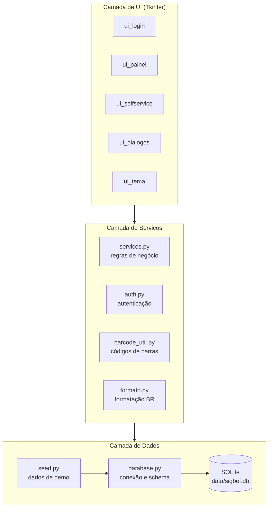
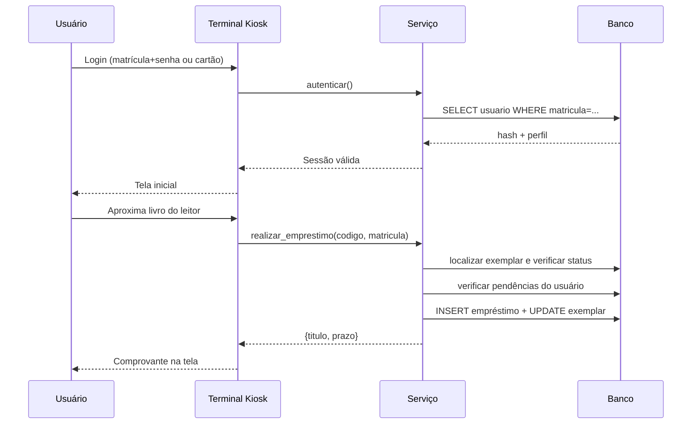
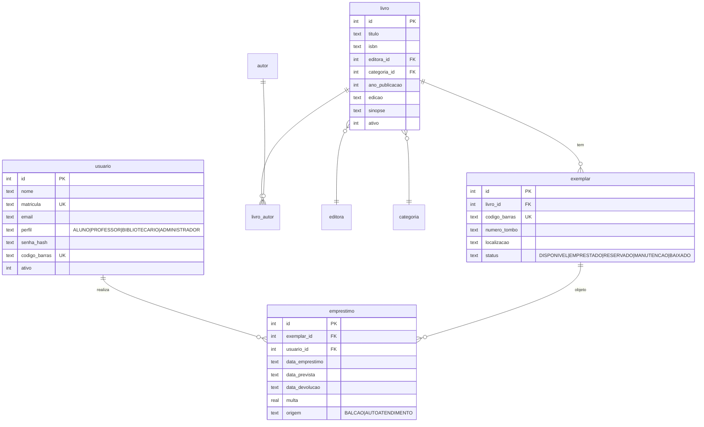

<div align="center">


# SIGBEF

### Sistema Integrado de Gestão da Biblioteca do CEFE

*Protótipo desktop completo para gestão bibliotecária — cadastro, empréstimo, devolução, autoatendimento e relatórios.*

[](LICENSE)
[](https://www.python.org/downloads/)
[](https://www.sqlite.org/)
[](https://docs.python.org/3/library/tkinter.html)

[](#)
[](#)
[](#)
[](#)
[](#)
[](docs/SIGBEF_Documento_Requisitos.docx)
[](https://marcelin1555.github.io/SIGBEF/)

</div>

---

## Capturas de tela

<table>
<tr>
<td align="center" width="50%">
<b>Tela de login</b><br/>

</td>
<td align="center" width="50%">
<b>Painel inicial (bibliotecário)</b><br/>

</td>
</tr>
<tr>
<td align="center">
<b>Empréstimos e devoluções</b><br/>

</td>
<td align="center">
<b>Terminal de autoatendimento</b><br/>

</td>
</tr>
<tr>
<td align="center" colspan="2">
<b>Detalhes do livro com etiquetas de código de barras</b><br/>

</td>
</tr>
</table>

> *As imagens acima são mockups SVG fiéis às telas do sistema. Para
> capturas de tela reais do executável em uso, veja a seção
> [Vídeo demo](#vídeo-demo).*

---

## Sumário

- [Capturas de tela](#capturas-de-tela)
- [Vídeo demo](#vídeo-demo)
- [Sobre o projeto](#sobre-o-projeto)
- [Principais funcionalidades](#principais-funcionalidades)
- [Stack tecnológica](#stack-tecnológica)
- [Download e instalação](#download-e-instalação)
- [Início rápido (modo desenvolvedor)](#início-rápido-modo-desenvolvedor)
- [Credenciais de demonstração](#credenciais-de-demonstração)
- [Arquitetura](#arquitetura)
- [Modelo de dados](#modelo-de-dados)
- [Regras de negócio](#regras-de-negócio)
- [Configuração](#configuração)
- [Estrutura do projeto](#estrutura-do-projeto)
- [Desenvolvimento](#desenvolvimento)
- [Roadmap](#roadmap)
- [Contribuindo](#contribuindo)
- [Licença](#licença)
- [Autoria](#autoria)

---

## Sobre o projeto

O **SIGBEF** é um sistema desktop para automatizar a operação de uma
biblioteca escolar, substituindo controles manuais e planilhas por uma
plataforma única que integra:

- **Cadastro do acervo** com geração automática de código de barras por exemplar
- **Pesquisa** flexível por título, autor, categoria, ISBN ou tombo
- **Empréstimos e devoluções** no balcão e em terminal de autoatendimento
- **Gestão de usuários** com perfis distintos (Aluno, Professor, Bibliotecário, Administrador)
- **Relatórios gerenciais** com exportação em CSV
- **Auditoria** completa das operações realizadas

O sistema foi projetado seguindo o padrão arquitetural em camadas, com
separação clara entre interface (Tkinter), regras de negócio (módulo
`servicos`) e persistência (SQLite + módulo `database`), facilitando
manutenção e testes.

---

## Principais funcionalidades

### Para o Bibliotecário e Administrador

| Recurso | Descrição |
|---|---|
| Painel inicial | Indicadores em tempo real: acervo, exemplares disponíveis, empréstimos em aberto, atrasos, top 10 mais emprestados |
| Cadastro de livros | Múltiplos autores, ISBN, editora, categoria, edição, sinopse e geração automática de exemplares com código de barras único |
| Etiquetas de barras | Visualização gráfica das etiquetas de cada exemplar para impressão |
| Cadastro de usuários | Cadastro com geração automática de cartão (código de barras) e definição de perfil |
| Empréstimo de balcão | Aceita código de barras ou número de tombo; seletor de exemplares disponíveis e busca de usuário integrados |
| Devolução de balcão | Cálculo automático de multa por dias de atraso |
| Renovação | Estende o prazo conforme perfil do usuário |
| Quitação de multa | Registro manual de multas pagas |
| Relatórios em CSV | Acervo, empréstimos abertos, usuários, livros mais emprestados |
| Configurações *(admin)* | Ajuste de prazos, limites e valores de multa |

### Para Alunos e Professores

| Recurso | Descrição |
|---|---|
| Pesquisa do acervo | Busca rápida por título, autor, categoria, ISBN ou código |
| Empréstimo direto | Selecione um livro disponível na lista e clique em "Pegar emprestado" |
| Histórico pessoal | Visualização dos próprios empréstimos com destaque para atrasados |
| Status do usuário | Resumo do limite usado, multas e bloqueios em uma frase |

### Terminal de Autoatendimento (kiosk)

| Recurso | Descrição |
|---|---|
| Login flexível | Por matrícula + senha **ou** código de barras do cartão |
| Empréstimo autônomo | O aluno aproxima o livro do leitor e confirma na tela |
| Devolução autônoma | Idem, com cálculo de multa e aviso para passar no balcão |
| Comprovante visual | Tela de confirmação com data prevista e detalhes |
| Sessão segura | Logout automático após 90 segundos de inatividade |

---

## Stack tecnológica

| Camada | Tecnologia |
|---|---|
| Linguagem | Python 3.10+ |
| Interface gráfica | Tkinter / ttk (biblioteca padrão) |
| Banco de dados | SQLite 3 (embarcado) |
| Hash de senha | PBKDF2-HMAC-SHA256 com sal aleatório (200 mil iterações) |
| Código de barras | Geração de identificadores únicos + renderização em canvas Tk |
| Relatórios | Exportação em CSV (`csv` da stdlib) |
| Empacotamento | Compatível com PyInstaller para distribuição |

> O protótipo **não exige nenhuma biblioteca externa** — usa apenas a
> biblioteca padrão do Python. Para impressão em massa de PNGs reais de
> código de barras, são opcionais `python-barcode` e `Pillow`
> (ver `requirements.txt`).

---

## Vídeo demo

> *Em breve: vídeo demonstrando o fluxo completo de cadastro, empréstimo
> e devolução no terminal de autoatendimento.*

[](https://youtube.com/SUBSTITUIR-PELO-LINK)

<details>
<summary><b>Como gravar seu próprio vídeo demo</b></summary>

### Ferramentas recomendadas (gratuitas)

| Ferramenta | Saída | Uso ideal |
|---|---|---|
| [OBS Studio](https://obsproject.com/) | MP4 / MKV | Vídeos longos com narração |
| [ScreenToGif](https://www.screentogif.com/) | GIF / MP4 | Demos curtas para o README |
| Xbox Game Bar | MP4 | `Win + Alt + R` no Windows |

### Roteiro sugerido (3 minutos)

1. **0:00 – Login** como `laiane` para mostrar o painel administrativo
2. **0:20 – Cadastro de livro** com geração automática de exemplares
3. **0:50 – Etiquetas de barras** dos exemplares
4. **1:20 – Empréstimo de balcão** usando o seletor de exemplares
5. **1:50 – Autoatendimento** logado como `2024001`
6. **2:30 – Empréstimo autônomo** lendo o código de barras
7. **2:50 – Comprovante e logout** automático

### Onde hospedar

- **YouTube** (recomendado): suba como "Não listado" se quiser link privado
- **GIF no próprio repositório**: coloque em `docs/demo.gif` (limite de 10 MB)

Depois é só substituir o link do badge acima.

</details>

---

## Download e instalação

### Para usar na biblioteca (sem precisar de Python)

| Forma | Quando usar | Tempo |
|---|---|---|
| **Releases do GitHub** | Mais simples — baixar `SIGBEF_Setup.exe` da [aba Releases](../../releases) | 2 min |
| **Pasta autônoma** | Quando você não tem privilégios de administrador no PC | 1 min |
| **Build local** | Quando quer customizar antes de distribuir | 10 min |

### Gerar o executável a partir do código

Veja o guia completo: [`docs/COMO_GERAR_EXECUTAVEL.md`](docs/COMO_GERAR_EXECUTAVEL.md)

**Resumo:**

```bash
# Garanta o Python 3.10+ instalado e dê duplo-clique em build.bat
# Ou manualmente:
pip install pyinstaller
pyinstaller sigbef.spec
# O executável fica em dist\SIGBEF\SIGBEF.exe
```

Para um instalador profissional `.exe` com atalhos no menu Iniciar e
desinstalador, use o [Inno Setup](https://jrsoftware.org/isinfo.php) com
o script `tools/sigbef_installer.iss` que já está no repositório.

### O que o executável traz

- `SIGBEF.exe` — aplicativo principal
- Banco SQLite criado em `%APPDATA%\SIGBEF\sigbef.db` na primeira execução
- Argumento `--autoatendimento` para abrir direto no modo kiosk
- Não precisa de Python instalado no computador alvo

---

## Início rápido (modo desenvolvedor)

### Pré-requisitos

- **Python 3.10 ou superior** — [download](https://www.python.org/downloads/)
- Sistema operacional: **Windows 10/11** ou **Linux** (Ubuntu 22.04+)
- No Linux, garanta que o pacote `python3-tk` esteja instalado:
  ```bash
  sudo apt-get install python3-tk
  ```

### Instalação e execução

```bash
# 1. Clone o repositório
git clone https://github.com/<seu-usuario>/sigbef.git
cd sigbef

# 2. Execute o sistema
#    Primeira vez: abre o assistente de configuração inicial
python sigbef.py

# Opcional: pular o wizard e popular com dados de demo
python sigbef.py --demo
```

### Modo Autoatendimento (kiosk)

Para abrir diretamente o terminal de autoatendimento, sem passar pelo
painel administrativo:

```bash
python sigbef.py --autoatendimento
```

---

## Primeira execução

Na primeira vez que o sistema é aberto, ele exibe um **assistente de
configuração** com 3 passos:

1. **Boas-vindas** — explica o que será feito
2. **Instituição** — informe o nome da escola/biblioteca
3. **Conta de administrador** — crie a primeira conta com matrícula,
   nome e senha

Depois disso, o login normal é exibido.

### Dados de demonstração (opcional)

Quer ver o sistema funcionando antes de cadastrar o acervo real?

- **Pela interface:** após o setup, entre como admin e vá em
  **Configurações → Ferramentas → Carregar dados de demonstração**.
- **Por linha de comando:** rode `python sigbef.py --demo` na primeira
  vez. O sistema pula o wizard e popula com 10 livros e 4 usuários.

Credenciais dos usuários de demo (somente quando carregados):

| Matrícula    | Senha          | Perfil         |
|--------------|----------------|----------------|
| `laiane`     | `laiane123`    | Bibliotecário  |
| `jaqueline`  | `jaqueline123` | Bibliotecário  |
| `macilene`   | `macilene123`  | Professor      |
| `2024001`    | `lucas123`     | Aluno          |
| `2024002`    | `beatriz123`   | Aluno          |

> **Importante:** essas senhas são públicas. Trocar (ou desativar essas
> contas) antes de usar em produção.

📖 **Veja também:** [Manual do Usuário completo](docs/MANUAL_DO_USUARIO.md) —
fluxos passo a passo por perfil de usuário.

---

## Arquitetura

O SIGBEF segue o padrão de **arquitetura em camadas**:



**Vantagens da separação:**
- A camada de serviços é independente da UI — pode ser reaproveitada por uma futura API REST ou aplicativo móvel
- O banco SQLite pode ser substituído por PostgreSQL alterando apenas `database.py`
- Testes unitários podem cobrir as regras sem precisar abrir telas

### Fluxo de empréstimo (autoatendimento)



---

## Modelo de dados



Tabelas auxiliares: `editora`, `categoria`, `autor`, `livro_autor` (M:N), `configuracao` (chave/valor) e `auditoria` (log de operações).

---

## Regras de negócio

| Regra | Valor padrão | Configurável |
|---|---|:---:|
| Prazo de empréstimo — aluno | 7 dias | Sim |
| Prazo de empréstimo — professor | 14 dias | Sim |
| Limite de empréstimos simultâneos — aluno | 3 | Sim |
| Limite de empréstimos simultâneos — professor | 5 | Sim |
| Multa por dia de atraso | R$ 1,50 | Sim |
| Teto máximo de multa | R$ 60,00 | Sim |
| Bloqueio por inadimplência | imediato | — |
| Exclusão de livros | sempre lógica (`ativo=0`) | — |

Todas as regras passíveis de ajuste estão na tela **Configurações** (acesso restrito ao perfil Administrador).

---

## Configuração

### Caminho do banco de dados

Por padrão o banco é criado em `./data/sigbef.db`. Para usar outro local
(útil em testes), defina a variável de ambiente:

```bash
# Linux/macOS
export SIGBEF_DB_PATH=/caminho/para/sigbef.db

# Windows (PowerShell)
$env:SIGBEF_DB_PATH = "C:\caminho\sigbef.db"
```

### Argumentos de linha de comando

| Argumento | Efeito |
|---|---|
| `--autoatendimento` ou `--kiosk` | Abre direto o terminal de autoatendimento, ignorando o login administrativo |

---

## Estrutura do projeto

```
SIGBIB/
├── sigbef.py                          # ponto de entrada (atalho)
├── requirements.txt                   # dependências (vazio — só std lib)
├── README.md                          # este arquivo
├── LICENSE                            # licença MIT
├── VERSION                            # versão atual
├── .gitignore
├── build.bat                          # gera o executável (Windows)
├── sigbef.spec                        # configuração do PyInstaller
│
├── sigbef/                            # código-fonte da aplicação
│   ├── __init__.py
│   ├── app.py                         # bootstrap da aplicação
│   ├── database.py                    # schema, conexão, configurações
│   ├── auth.py                        # autenticação e hash de senha
│   ├── servicos.py                    # regras de negócio
│   ├── seed.py                        # dados de demonstração
│   ├── barcode_util.py                # geração de código de barras
│   ├── formato.py                     # formatação BR (datas, R$)
│   ├── ui_tema.py                     # tema visual e estilos ttk
│   ├── ui_login.py                    # tela de login
│   ├── ui_painel.py                   # painel principal
│   ├── ui_dialogos.py                 # diálogos modais reutilizáveis
│   ├── ui_selfservice.py              # terminal de autoatendimento
│   └── ui_setup.py                    # assistente de primeira execução
│
├── docs/                              # documentação completa
│   ├── MANUAL_DO_USUARIO.md           # manual do usuário final
│   ├── CHANGELOG.md                   # histórico de versões
│   ├── COMO_GERAR_EXECUTAVEL.md       # guia de build
│   ├── PUBLICAR_NO_GITHUB.md          # guia de publicação
│   ├── SIGBEF_Documento_Requisitos.docx  # documento de requisitos
│   └── screenshots/                   # mockups SVG das telas
│
├── apresentacao/                      # material institucional / pitch
│   ├── pptx/                          # apresentação pronta (PPTX + HTML)
│   ├── geradores/                     # scripts que regeneram a apresentação
│   └── sebrae/                        # material do Desafio Liga Jovem
│
├── assets/                            # identidade visual
│   ├── sigbef.svg                     # logo / ícone
│   └── sigbef.ico                     # gerado pelo build
│
├── tools/                             # scripts de desenvolvimento
│   ├── gerar_icone.py                 # gera assets/sigbef.ico
│   ├── sigbef_installer.iss           # script Inno Setup
│   └── setup_github.bat               # init + push do repo
│
└── data/                              # (gitignored) banco SQLite em runtime
    └── sigbef.db
```

---

## Desenvolvimento

### Como o código está organizado

- **Cada arquivo de UI implementa apenas uma tela ou diálogo.** Para criar uma nova seção, herde de `SecaoBase` em `ui_painel.py` e implemente o método `atualizar()`.
- **Toda lógica de negócio está em `servicos.py`.** A UI nunca executa SQL diretamente — sempre passa por uma função de serviço.
- **Erros de regra de negócio** são lançados como `RegraNegocioError` e devem ser apresentados ao usuário com `messagebox.showwarning(...)`.
- **Auditoria automática:** chame `registrar_auditoria(usuario_id, acao, detalhes)` ao final de operações relevantes.

### Empacotamento como executável

Use o `build.bat` na raiz do projeto (faz tudo automaticamente) **ou**
manualmente:

```bash
pip install pyinstaller
pyinstaller sigbef.spec
```

O executável e suas dependências ficam em `dist/SIGBEF/`. Veja o guia
[`docs/COMO_GERAR_EXECUTAVEL.md`](docs/COMO_GERAR_EXECUTAVEL.md) para o instalador
profissional com Inno Setup.

### Adicionando uma nova tabela

1. Acrescente o `CREATE TABLE IF NOT EXISTS ...` em `SCHEMA_SQL` (em `database.py`)
2. Adicione um helper na camada de serviços
3. Construa a UI consumindo somente esse helper

---

## Roadmap

Funcionalidades planejadas para versões futuras:

- [ ] Aplicativo móvel (Android/iOS) para consulta do acervo
- [ ] API REST para integração com outros sistemas
- [ ] Importação de acervo a partir de planilha CSV/Excel
- [ ] Importação de metadados via ISBN (Google Books, OpenLibrary)
- [ ] Notificações por e-mail quando o prazo se aproxima
- [ ] Reservas online (com fila de espera)
- [ ] Painel de BI / dashboards interativos
- [ ] Suporte a múltiplas unidades / bibliotecas
- [ ] Migração para PostgreSQL para ambientes em rede
- [ ] Internacionalização (i18n) para outros idiomas

---

## Contribuindo

Contribuições são bem-vindas. Para colaborar:

1. Faça um *fork* do repositório
2. Crie uma branch para sua feature: `git checkout -b feat/minha-feature`
3. Faça commit das suas mudanças: `git commit -m "feat: descrição"`
4. Faça push da branch: `git push origin feat/minha-feature`
5. Abra um *Pull Request*

Padrão de commit recomendado: [Conventional Commits](https://www.conventionalcommits.org/pt-br/).

---

## Licença

Este projeto é distribuído sob a **Licença MIT** — veja o arquivo
[`LICENSE`](LICENSE) para o texto completo.

```
Copyright (c) 2026 Marcello
SPDX-License-Identifier: MIT
```

A Licença MIT permite uso, cópia, modificação e distribuição (inclusive
comercial) deste software, desde que o aviso de copyright seja preservado.
O software é fornecido "como está", sem garantias.

---

## Autoria

Desenvolvido por **Marcello** como protótipo do Sistema Integrado de
Gestão da Biblioteca do CEFE.

Documento de requisitos completo: [`docs/SIGBEF_Documento_Requisitos.docx`](docs/SIGBEF_Documento_Requisitos.docx)

---

<div align="center">

**SIGBEF v1.2.0** — Maio/2026

Se este projeto te ajudou, considere dar uma ⭐ no GitHub.

</div>
