<div align="center">

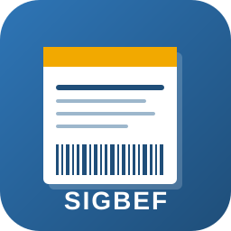

# SIGBEF

### Sistema Integrado de Gestão da Biblioteca do CEFE

*Sistema completo para gestão bibliotecária — desktop, aplicativo do aluno e API —, gratuito e offline, desenvolvido por estudantes do CEFE para escolas públicas brasileiras.*

[](LICENSE)
[](https://www.python.org/downloads/)
[](https://www.sqlite.org/)
[](https://docs.python.org/3/library/tkinter.html)

[](#)
[](#)
[](#)
[](#)
[](#)
[](docs/SIGBEF_Documento_Requisitos.docx)
[](https://sigbef.vercel.app/)

</div>

---

## Capturas de tela

<table>
<tr>
<td align="center" width="50%">
<b>Tela de login</b><br/>
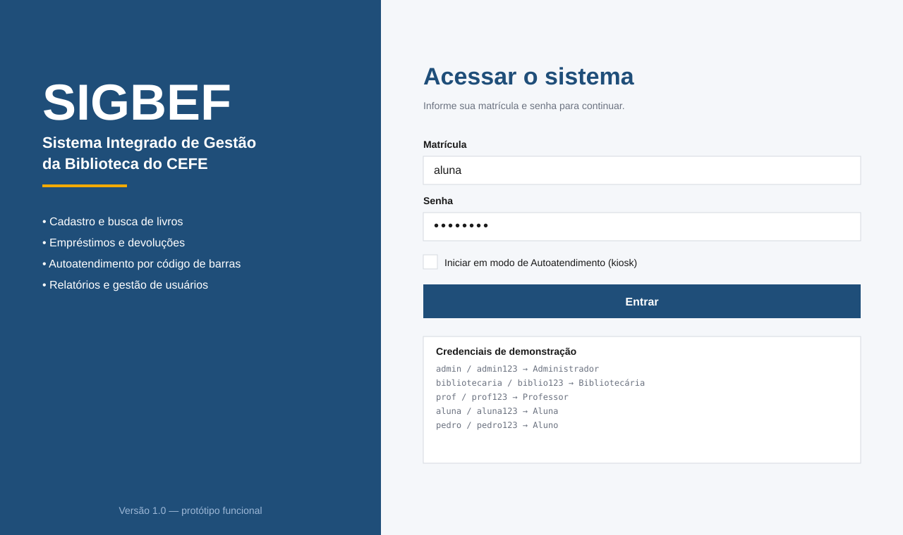
</td>
<td align="center" width="50%">
<b>Painel inicial (bibliotecário)</b><br/>
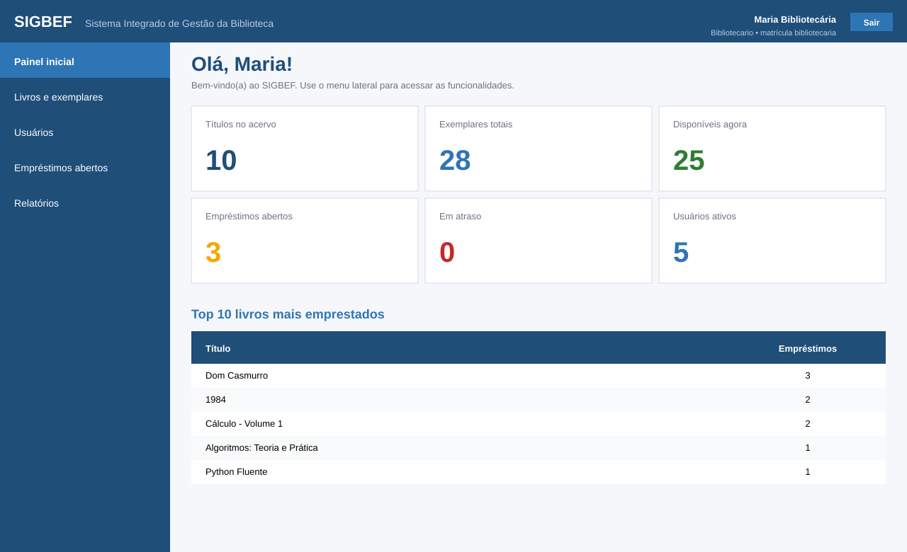
</td>
</tr>
<tr>
<td align="center">
<b>Empréstimos e devoluções</b><br/>
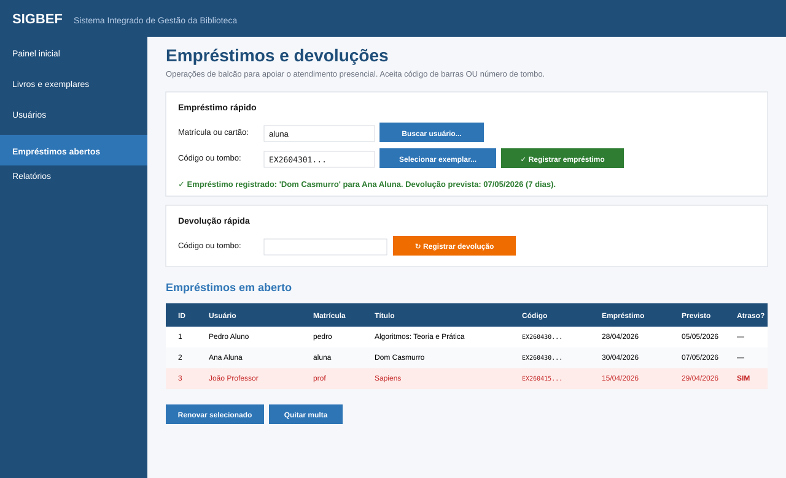
</td>
<td align="center">
<b>Terminal de autoatendimento</b><br/>
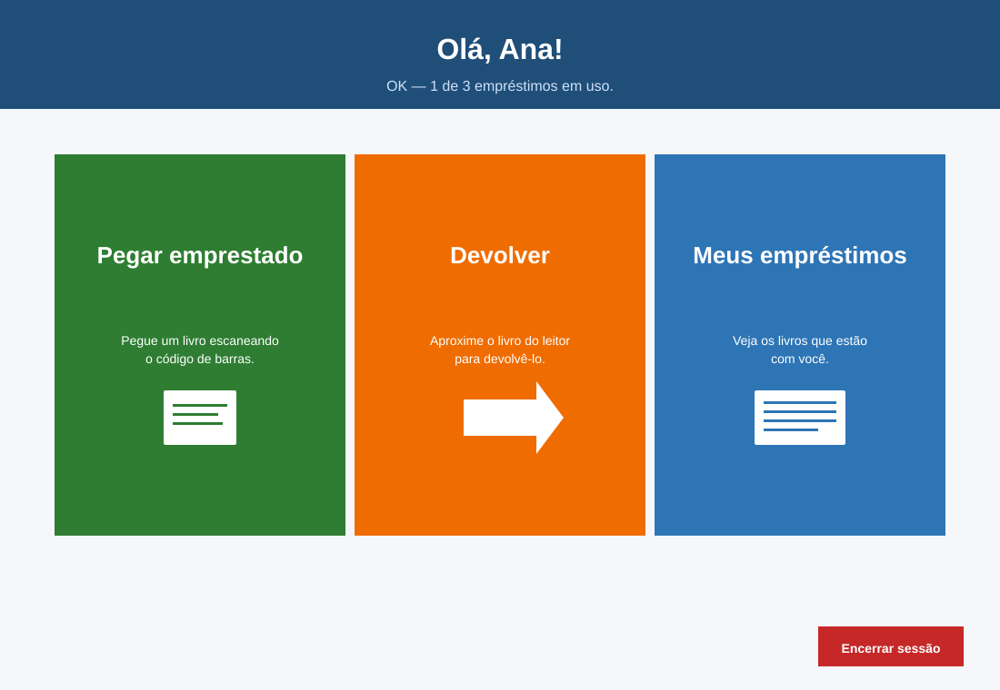
</td>
</tr>
<tr>
<td align="center" colspan="2">
<b>Detalhes do livro com etiquetas de código de barras</b><br/>
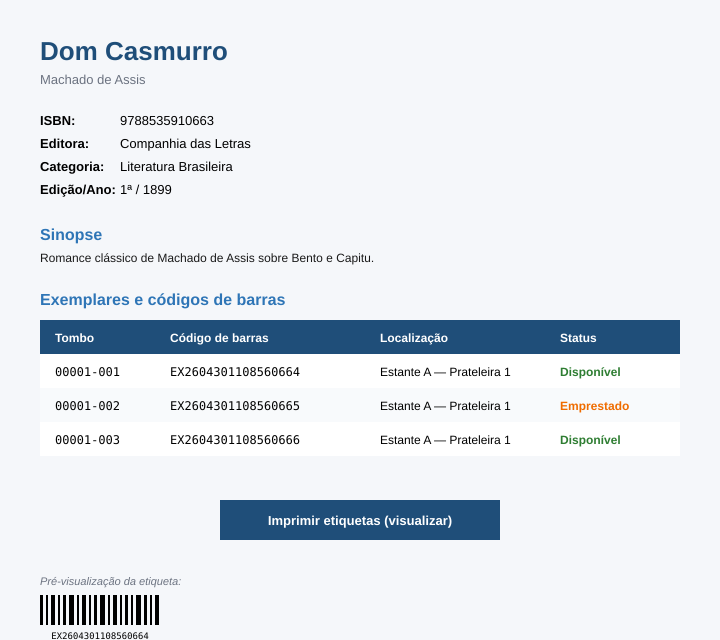
</td>
</tr>
</table>

> *As imagens acima são mockups SVG fiéis às telas do sistema.*

---

## Sumário

- [Capturas de tela](#capturas-de-tela)
- [Sobre o projeto](#sobre-o-projeto)
- [Principais funcionalidades](#principais-funcionalidades)
- [Stack tecnológica](#stack-tecnológica)
- [Site oficial](#site-oficial)
- [Download e instalação](#download-e-instalação)
- [Início rápido (modo desenvolvedor)](#início-rápido-modo-desenvolvedor)
- [Credenciais de demonstração](#credenciais-de-demonstração)
- [Arquitetura](#arquitetura)
- [Modelo de dados](#modelo-de-dados)
- [Regras de negócio](#regras-de-negócio)
- [Configuração](#configuração)
- [Estrutura do projeto](#estrutura-do-projeto)
- [Desenvolvimento](#desenvolvimento)
- [Roadmap](#roadmap)
- [Contribuindo](#contribuindo)
- [Licença](#licença)
- [Autoria](#autoria)

---

## Sobre o projeto

O **SIGBEF** é um sistema para automatizar a operação de uma biblioteca
escolar, substituindo controles manuais e planilhas por uma plataforma
única que integra:

- **Cadastro do acervo** com geração automática de código de barras por exemplar
- **Pesquisa** flexível por título, autor, categoria, ISBN ou tombo
- **Empréstimos e devoluções** no balcão e em terminal de autoatendimento
- **Reservas com fila de espera**, com separação automática do exemplar
  na devolução e aviso por e-mail (opt-in)
- **Gestão de usuários** com perfis distintos (Aluno, Professor, Bibliotecário, Administrador)
- **Painel de uso do acervo** com gráficos e a lista do que nunca saiu
  da estante
- **Relatórios gerenciais** com exportação em CSV
- **Auditoria** completa das operações realizadas

O sistema foi projetado seguindo o padrão arquitetural em camadas, com
separação clara entre interface (Tkinter), regras de negócio (módulo
`servicos`) e persistência (SQLite + módulo `database`), facilitando
manutenção e testes.

Além do desktop, o projeto tem:

- **Aplicativo Android** para o aluno (Kotlin + Jetpack Compose):
  acervo, carteirinha com código de barras real, empréstimos, reserva,
  renovação e sugestões de leitura. Funciona offline e conversa apenas
  com o computador da biblioteca, pela rede da escola — sem nuvem. Ver
  [`sigbef-mobile/`](sigbef-mobile/README.md)
- **API REST** opcional, para o aplicativo e para integração com outros
  sistemas escolares. Ver [`docs/API.md`](docs/API.md)
- **Site de apresentação** em React + Vite, hospedado na Vercel:
  https://sigbef.vercel.app/

---

## Principais funcionalidades

### Para o Bibliotecário e Administrador

| Recurso | Descrição |
|---|---|
| Painel inicial | Indicadores em tempo real: acervo, exemplares disponíveis, empréstimos em aberto, atrasos, top 10 mais emprestados |
| Cadastro de livros | Múltiplos autores, ISBN, editora, categoria, edição, sinopse e geração automática de exemplares com código de barras único |
| Etiquetas de barras | Visualização gráfica das etiquetas de cada exemplar para impressão |
| Cadastro de usuários | Cadastro com geração automática de cartão (código de barras) e definição de perfil |
| Empréstimo de balcão | Aceita código de barras ou número de tombo; seletor de exemplares disponíveis e busca de usuário integrados |
| Devolução de balcão | Cálculo automático de multa por dias de atraso |
| Renovação | Estende o prazo conforme perfil do usuário |
| Quitação de multa | Registro manual de multas pagas |
| Fila de espera | Quem espera cada livro, com destaque para os exemplares já separados e o prazo de retirada |
| Uso do acervo | Empréstimos por mês, turmas e categorias, taxa de atraso e a lista dos livros que nunca saíram |
| Conferir acervo | Conferência com o leitor na estante: o que não foi encontrado, o que está emprestado e o que apareceu sem estar previsto |
| Baixa de exemplar | Tira do acervo um exemplar extraviado, danificado, descartado ou doado, sem levar o título junto |
| Relatórios em CSV | Acervo, empréstimos abertos, usuários, mais emprestados, pendências dos leitores e a movimentação do período |
| Período nos relatórios | Recorte por datas, com atalhos para o mês, o bimestre e o ano |
| Cópia de segurança | Automática ao fechar o sistema, guardando as últimas 7 |
| Pareamento de celular | QR code para o aluno conectar o aplicativo, e controle dos aparelhos ligados |
| Configurações *(admin)* | Ajuste de prazos, limites e valores de multa |

### Para Alunos e Professores

| Recurso | Descrição |
|---|---|
| Pesquisa do acervo | Busca rápida por título, autor, categoria, ISBN ou código |
| Empréstimo direto | Selecione um livro disponível na lista e clique em "Pegar emprestado" |
| Reserva | Entrar na fila de um livro emprestado e acompanhar a posição |
| Histórico pessoal | Visualização dos próprios empréstimos com destaque para atrasados |
| Status do usuário | Resumo do limite usado, multas e bloqueios em uma frase |

### No celular (aplicativo Android)

| Recurso | Descrição |
|---|---|
| Pareamento por QR | A câmera lê o código que a biblioteca mostra na tela; digitar o endereço também funciona |
| Carteirinha digital | Código de barras Code 128 real, lido pelo mesmo leitor do balcão — e funciona sem rede |
| Meus empréstimos | Prazos, atrasos, histórico e a fila de espera |
| Renovar | Com as regras da biblioteca: não renova atrasado, com fila ou acima do limite |
| Reservar | Entrar e sair da fila de espera direto da ficha do livro |
| Minha leitura | Quanto o aluno já leu e sugestões de próximos livros, com o motivo de cada uma |
| Offline | Tudo que já foi baixado continua acessível fora da escola |

### Terminal de Autoatendimento (kiosk)

| Recurso | Descrição |
|---|---|
| Login flexível | Por matrícula + senha **ou** código de barras do cartão |
| Empréstimo autônomo | O aluno aproxima o livro do leitor e confirma na tela |
| Devolução autônoma | Idem, com cálculo de multa e aviso para passar no balcão |
| Comprovante visual | Tela de confirmação com data prevista e detalhes |
| Sessão segura | Logout automático após 90 segundos de inatividade |

---

## Stack tecnológica

### Desktop

| Camada | Tecnologia |
|---|---|
| Linguagem | Python 3.10+ |
| Interface gráfica | Tkinter / ttk (biblioteca padrão) |
| Banco de dados | SQLite 3 (embarcado, modo WAL) |
| Hash de senha | PBKDF2-HMAC-SHA256 com sal aleatório (200 mil iterações) |
| Código de barras | Code 128 implementado em Python puro (`barcode_util`) |
| QR code | Implementado em Python puro (`qr_util`), para o pareamento |
| Gráficos | Desenhados em Canvas do Tk (`ui_graficos`) |
| API REST | `http.server` da stdlib, opt-in |
| Relatórios | Exportação em CSV (`csv` da stdlib) |
| Empacotamento | PyInstaller + Inno Setup |

> O sistema **não exige nenhuma biblioteca externa** para funcionar —
> usa apenas a biblioteca padrão do Python. É por isso que o Code 128, o
> QR code e os gráficos foram escritos à mão: numa escola pública, cada
> dependência é um problema a mais na hora de instalar. Para impressão
> em massa de PNGs de código de barras, são opcionais `python-barcode` e
> `Pillow` (ver `requirements.txt`).

### Aplicativo Android

| Camada | Tecnologia |
|---|---|
| Linguagem | Kotlin |
| Interface | Jetpack Compose (Material 3) |
| Arquitetura | MVVM com StateFlow |
| Cache local | Room |
| Rede | Retrofit + Moshi + OkHttp |
| Leitura de QR | CameraX + ML Kit embarcado (sem depender do Play Services) |
| minSdk | 24 (Android 7) |

---

## Site oficial

O site de apresentação do SIGBEF está disponível em:

**https://sigbef.vercel.app/**

Construído com React + Vite + Tailwind CSS + React Router, com 6 páginas:
`/` (landing), `/funcionalidades`, `/download`, `/planos`, `/equipe`, `/novidades`.

Código-fonte do site em `site/` — ver [`site/README.md`](site/README.md).

---

## Download e instalação

### Para usar na biblioteca (sem precisar de Python)

| Forma | Quando usar | Tempo |
|---|---|---|
| **Releases do GitHub** | Mais simples — baixar `SIGBEF_Setup.exe` da [aba Releases](../../releases) | 2 min |
| **Pasta autônoma** | Quando você não tem privilégios de administrador no PC | 1 min |
| **Build local** | Quando quer customizar antes de distribuir | 10 min |

### Gerar o executável a partir do código

Veja o guia completo: [`docs/COMO_GERAR_EXECUTAVEL.md`](docs/COMO_GERAR_EXECUTAVEL.md)
Para o aplicativo Android: [`docs/COMO_GERAR_APK.md`](docs/COMO_GERAR_APK.md)

**Resumo:**

```bash
# Windows: garanta o Python 3.10+ instalado e dê duplo-clique em build.bat
# Linux/macOS: rode ./build.sh
# Ou manualmente em qualquer plataforma:
pip install pyinstaller
pyinstaller sigbef.spec
# Windows/Linux: dist/SIGBEF/  ·  macOS: dist/SIGBEF.app
```

Cada release também é compilada automaticamente para **Windows, Linux e
macOS** pelo GitHub Actions (`.github/workflows/build.yml`), com os
pacotes anexados na [aba Releases](../../releases).

Para um instalador profissional `.exe` com atalhos no menu Iniciar e
desinstalador, use o [Inno Setup](https://jrsoftware.org/isinfo.php) com
o script `tools/sigbef_installer.iss` que já está no repositório.

### O que o executável traz

- `SIGBEF.exe` — aplicativo principal
- Banco SQLite criado em `%APPDATA%\SIGBEF\sigbef.db` na primeira execução
- Argumento `--autoatendimento` para abrir direto no modo kiosk
- Não precisa de Python instalado no computador alvo

---

## Início rápido (modo desenvolvedor)

### Pré-requisitos

- **Python 3.10 ou superior** — [download](https://www.python.org/downloads/)
- Sistema operacional: **Windows 10/11** ou **Linux** (Ubuntu 22.04+)
- No Linux, garanta que o pacote `python3-tk` esteja instalado:
  ```bash
  sudo apt-get install python3-tk
  ```

### Instalação e execução

```bash
# 1. Clone o repositório
git clone https://github.com/marcelin1555/SIGBEF.git
cd SIGBEF

# 2. Execute o sistema
#    Primeira vez: abre o assistente de configuração inicial
python sigbef.py

# Opcional: pular o wizard e popular com dados de demo
python sigbef.py --demo
```

### Modo Autoatendimento (kiosk)

Para abrir diretamente o terminal de autoatendimento, sem passar pelo
painel administrativo:

```bash
python sigbef.py --autoatendimento
```

---

## Primeira execução

Na primeira vez que o sistema é aberto, ele exibe um **assistente de
configuração** com 3 passos:

1. **Boas-vindas** — explica o que será feito
2. **Instituição** — informe o nome da escola/biblioteca
3. **Conta de administrador** — crie a primeira conta com matrícula,
   nome e senha

Depois disso, o login normal é exibido.

### Dados de demonstração (opcional)

Quer ver o sistema funcionando antes de cadastrar o acervo real?

- **Pela interface:** após o setup, entre como admin e vá em
  **Configurações → Ferramentas → Carregar dados de demonstração**.
- **Por linha de comando:** rode `python sigbef.py --demo` na primeira
  vez. O sistema pula o wizard e popula com 10 livros e 4 usuários.

Credenciais dos usuários de demo (somente quando carregados):

| Matrícula    | Senha          | Perfil         |
|--------------|----------------|----------------|
| `laiane`     | `laiane123`    | Bibliotecário  |
| `jaqueline`  | `jaqueline123` | Bibliotecário  |
| `macilene`   | `macilene123`  | Professor      |
| `2024001`    | `lucas123`     | Aluno          |
| `2024002`    | `beatriz123`   | Aluno          |

> **Importante:** essas senhas são públicas. Trocar (ou desativar essas
> contas) antes de usar em produção.

📖 **Veja também:** [Manual do Usuário completo](docs/MANUAL_DO_USUARIO.md) —
fluxos passo a passo por perfil de usuário.

---

## Arquitetura

### Em palavras simples (para quem não é de TI)

O SIGBEF é organizado por dentro como a própria biblioteca é organizada por fora — em três "setores" que não se misturam:

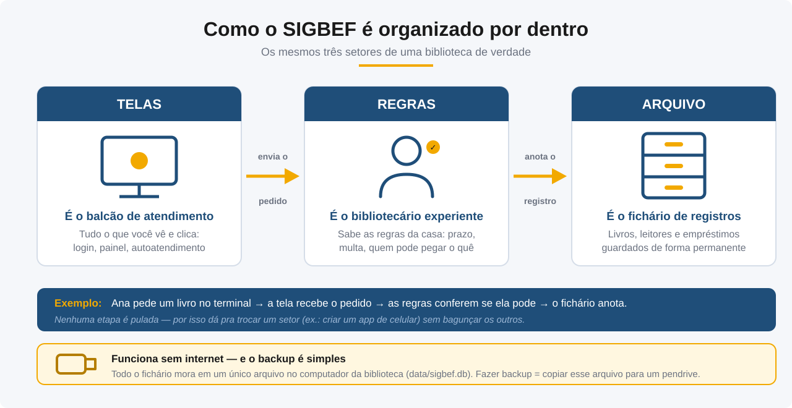

### Visão técnica

O SIGBEF segue o padrão de **arquitetura em camadas**:

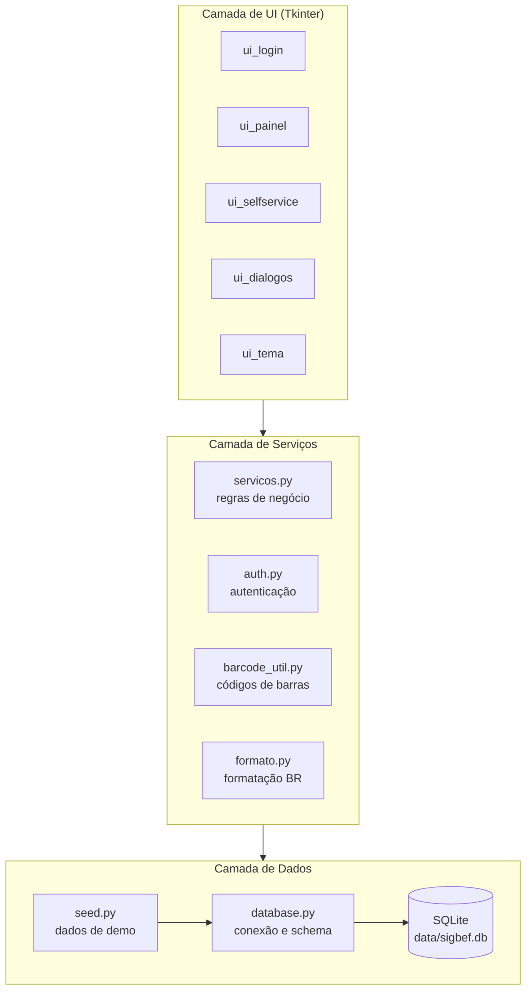

**Vantagens da separação:**
- A camada de serviços é independente da UI — pode ser reaproveitada por uma futura API REST ou aplicativo móvel
- O banco SQLite pode ser substituído por PostgreSQL alterando apenas `database.py`
- Testes unitários podem cobrir as regras sem precisar abrir telas

### Fluxo de empréstimo (autoatendimento)

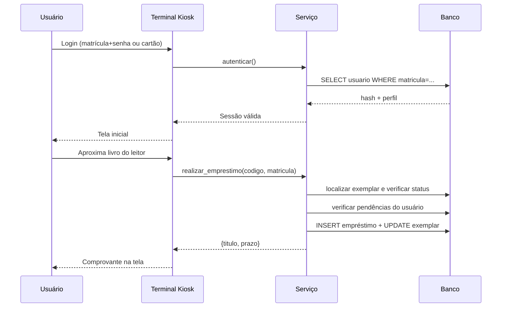

---

## Modelo de dados

### Em palavras simples (para quem não é de TI)

O banco de dados do SIGBEF funciona como aquele fichário de gavetas das bibliotecas antigas — só que preenchido e cruzado automaticamente:

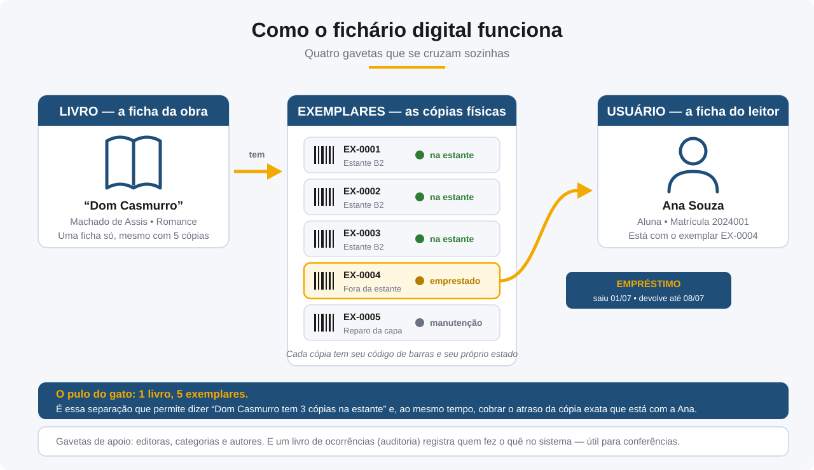

### Visão técnica

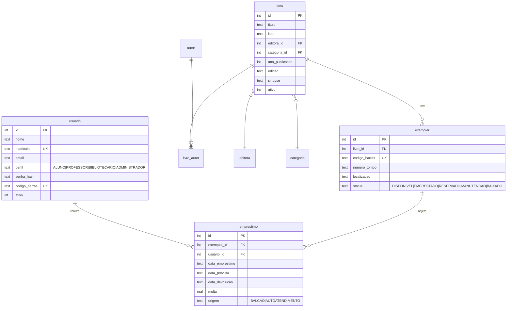

Tabelas auxiliares: `editora`, `categoria`, `autor`, `livro_autor` (M:N), `configuracao` (chave/valor) e `auditoria` (log de operações).

---

## Regras de negócio

| Regra | Valor padrão | Configurável |
|---|---|:---:|
| Prazo de empréstimo — aluno | 7 dias | Sim |
| Prazo de empréstimo — professor | 14 dias | Sim |
| Limite de empréstimos simultâneos — aluno | 3 | Sim |
| Limite de empréstimos simultâneos — professor | 5 | Sim |
| Multa por dia de atraso | R$ 1,50 | Sim |
| Teto máximo de multa | R$ 60,00 | Sim |
| Bloqueio por inadimplência | imediato | — |
| Exclusão de livros | sempre lógica (`ativo=0`) | — |

Todas as regras passíveis de ajuste estão na tela **Configurações** (acesso restrito ao perfil Administrador).

---

## Configuração

### Caminho do banco de dados

Por padrão o banco é criado em `./data/sigbef.db`. Para usar outro local
(útil em testes), defina a variável de ambiente:

```bash
# Linux/macOS
export SIGBEF_DB_PATH=/caminho/para/sigbef.db

# Windows (PowerShell)
$env:SIGBEF_DB_PATH = "C:\caminho\sigbef.db"
```

### Argumentos de linha de comando

| Argumento | Efeito |
|---|---|
| `--autoatendimento` ou `--kiosk` | Abre direto o terminal de autoatendimento, ignorando o login administrativo |

---

## Estrutura do projeto

```
├── sigbef/                            # código-fonte do desktop
│   ├── app.py                         # bootstrap da aplicação
│   ├── database.py                    # schema, conexão, configurações
│   ├── auth.py                        # autenticação, hash e sessão do app
│   ├── servicos.py                    # regras de negócio
│   ├── reservas.py                    # fila de espera e promoção automática
│   ├── api.py                         # API REST (opt-in)
│   ├── notificacoes.py                # avisos por e-mail (opt-in)
│   ├── isbn_lookup.py                 # metadados por ISBN (opt-in)
│   ├── seed.py                        # dados de demonstração
│   ├── barcode_util.py                # Code 128 em Python puro
│   ├── qr_util.py                     # QR code em Python puro
│   ├── formato.py                     # formatação BR (datas, R$)
│   ├── icones.py / icones_data.py     # ícones embutidos
│   ├── ui_tema.py                     # tema visual e estilos ttk
│   ├── ui_graficos.py                 # gráficos em Canvas Tk
│   ├── ui_login.py                    # tela de login
│   ├── ui_painel.py                   # painel principal
│   ├── ui_dialogos.py                 # diálogos modais reutilizáveis
│   ├── ui_selfservice.py              # terminal de autoatendimento
│   └── ui_setup.py                    # assistente de primeira execução
│
├── sigbef-mobile/                     # aplicativo Android (Kotlin/Compose)
│   └── app/src/main/java/br/rn/cefe/sigbef/
│       ├── data/                      # Room (cache), Retrofit (API)
│       ├── model/                     # modelos de domínio
│       └── ui/                        # telas, componentes e tema
│
├── tests/                             # suíte de testes do desktop
│
├── site/                              # site de apresentação (React + Vite)
│
├── docs/                              # documentação completa
│   ├── MANUAL_DO_USUARIO.md           # manual do usuário final
│   ├── TREINAMENTO.md                 # roteiro de capacitação
│   ├── CHANGELOG.md                   # histórico de versões
│   ├── API.md                         # referência da API REST
│   ├── DESIGN.md                      # identidade visual (desktop, site, app)
│   ├── SIGBEF_MOBILE.md               # especificação do aplicativo
│   ├── AUDITORIA_MOBILE.md            # auditoria do app herdado
│   ├── COMO_GERAR_EXECUTAVEL.md       # guia de build do desktop
│   ├── COMO_GERAR_APK.md              # guia de build e assinatura do app
│   ├── PUBLICAR_NO_GITHUB.md          # guia de publicação
│   ├── SIGBEF_Documento_Requisitos.docx  # requisitos v2.0, com status de cada um
│   ├── SIGBEF_Documento_Requisitos_v1.0_abril2026.docx  # planejamento original
│   └── screenshots/                   # mockups SVG das telas
│
├── apresentacao/                      # material institucional / pitch
│   ├── pptx/                          # apresentação pronta (PPTX + HTML)
│   ├── geradores/                     # scripts que regeneram a apresentação
│   └── sebrae/                        # material do Desafio Liga Jovem
│
├── assets/                            # identidade visual
├── tools/                             # scripts de desenvolvimento
│   ├── gerar_icone.py                 # gera assets/sigbef.ico
│   ├── sigbef_installer.iss           # script Inno Setup
│   └── setup_github.bat               # init + push do repo
│
└── data/                              # (gitignored) banco SQLite em runtime
    └── sigbef.db
```

---

## Desenvolvimento

### Como o código está organizado

- **Cada arquivo de UI implementa apenas uma tela ou diálogo.** Para criar uma nova seção, herde de `SecaoBase` em `ui_painel.py` e implemente o método `atualizar()`.
- **Toda lógica de negócio está em `servicos.py`.** A UI nunca executa SQL diretamente — sempre passa por uma função de serviço.
- **Erros de regra de negócio** são lançados como `RegraNegocioError` e devem ser apresentados ao usuário com `messagebox.showwarning(...)`.
- **Auditoria automática:** chame `registrar_auditoria(usuario_id, acao, detalhes)` ao final de operações relevantes.

### Empacotamento como executável

Use o `build.bat` na raiz do projeto (faz tudo automaticamente) **ou**
manualmente:

```bash
pip install pyinstaller
pyinstaller sigbef.spec
```

O executável e suas dependências ficam em `dist/SIGBEF/`. Veja o guia
[`docs/COMO_GERAR_EXECUTAVEL.md`](docs/COMO_GERAR_EXECUTAVEL.md) para o instalador
profissional com Inno Setup.

### Adicionando uma nova tabela

1. Acrescente o `CREATE TABLE IF NOT EXISTS ...` em `SCHEMA_SQL` (em `database.py`)
2. Se a tabela já existe em bancos instalados, trate a coluna nova em
   `_migrar_schema()` — escola em produção não recria o banco
3. Adicione um helper na camada de serviços
4. Construa a UI consumindo somente esse helper

### Testes

```bash
python -m unittest discover -s tests        # suíte do desktop
```

Os testes rodam contra um banco SQLite temporário, recriado a cada caso
(`tests/base.py`), e **nunca tocam** o banco real. Regra do projeto:
correção de bug entra com o teste que a trava.

### Aplicativo Android

```bash
cd sigbef-mobile
./gradlew testDebugUnitTest     # testes
./gradlew assembleDebug         # APK de depuração
```

Para gerar o APK assinado que vai para os alunos, veja
[`docs/COMO_GERAR_APK.md`](docs/COMO_GERAR_APK.md).

---

## Roadmap

Funcionalidades planejadas para versões futuras:

> O sistema está congelado até a III FICTS, em 16 de setembro de 2026.
> Mexer no que vai ser demonstrado ao vivo, às vésperas da feira, é risco
> sem retorno. A tela de auditoria já saiu, por ser leitura pura; o resto
> desta lista fica para depois da feira.

### Próxima versão

- [ ] **Restaurar uma cópia de segurança pela tela** — hoje o sistema faz
      backup todo dia e não tem como usar. Recuperar exige fechar o
      programa, achar a pasta e sobrescrever o arquivo na mão. Backup que
      não se restaura é meio backup. É a segunda operação mais destrutiva
      do sistema, então merece o mesmo cuidado do apagar tudo: cópia do
      estado atual antes, e confirmação digitada
- [ ] **Isentar multa, com motivo** — hoje só existe quitar. Perdoar uma
      multa obriga a bibliotecária a registrar como paga, ou seja, a
      gravar no histórico uma coisa que não aconteceu
- [ ] **Empréstimo de coleção para o professor** — livro-texto para a
      turma inteira num registro só, em vez de trinta. A dúvida que
      travava isso era em nome de quem fica o exemplar; a proposta é
      **no nome do professor, com a turma anotada**, porque é ele quem
      responde pelos trinta livros

### Para outra escola conseguir adotar sozinha

A conclusão do relatório de pesquisa registra que a replicação está
tecnicamente estabelecida mas ainda não foi testada em campo. Estes são
os obstáculos concretos:

- [ ] **Importação com mapa de colunas** — hoje o CSV precisa de nomes
      que o sistema reconheça, e cada escola tem a planilha dela. Uma
      etapa para dizer "esta coluna é o título" resolve o caso geral, que
      é o maior obstáculo real de quem chega de fora
- [ ] **Modo de demonstração reversível** — popular dados de exemplo e
      apagar tudo já existem separados; falta amarrar os dois no caminho
      de quem está avaliando o sistema antes de usar pra valer

### Para medir melhor o efeito do sistema

- [ ] **Tempo real de atendimento** — os quinze minutos da planilha são
      estimativa da bibliotecária, e os 5 ms do experimento são medida de
      máquina. Nenhum dos dois mede o balcão. O autoatendimento já sabe
      quando a sessão abre e fecha: gravar isso dá o antes e depois
      medido, que é o que falta para fechar a hipótese com dado e não com
      percepção

### Aproximação de normas de biblioteconomia

O SIGBEF hoje atende bem a realidade da biblioteca escolar (ISBN,
número de tombo, código de barras), mas não implementa os padrões
usados por bibliotecas maiores (MARC21, CDD/CDU, Z39.50) — decisão
consciente para manter a simplicidade. Passos incrementais e opt-in
para quem quiser se aproximar desses padrões, sem obrigar ninguém:

- [ ] Campo de classificação (CDD ou CDU) e número de chamada por
      livro, para gerar etiqueta de lombada
- [ ] Exportação do acervo em formato MARC21, para facilitar migração
      futura a um sistema profissional (Pergamum, Sophia)
- [ ] Catalogação automática por ISBN puxando também classificação
      Dewey, quando disponível na fonte (reaproveita o opt-in
      `ISBN_LOOKUP` já existente)

### Longo prazo

- [ ] Suporte a múltiplas unidades/bibliotecas na mesma instalação
- [ ] Migração opcional para PostgreSQL para ambientes em rede com múltiplos postos
- [ ] Internacionalização (i18n) — espanhol e inglês como primeiros idiomas adicionais
- [ ] Versão web hospedada (SaaS) para escolas sem servidor local

### Saúde do próprio projeto

- [ ] **Capturas de tela de verdade no README** — as imagens em
      `docs/screenshots/` são mockups, e o aviso embaixo da tabela diz
      isso. O risco é alguém reaproveitar aquilo como evidência sem ler o
      aviso, o que num trabalho de pesquisa seria apresentar prova falsa
- [ ] **Teste da camada de interface** — a suíte cobre bem serviço e
      dados, mas os diálogos não têm teste. Os dois últimos defeitos de
      tela (dica cortada na borda e campo que não aparecia) foram achados
      no olho, rodando o programa

### Descartado, e por quê

- **Reescrita em Java.** Esteve no roadmap como ideia em aberto.
  Reescrever um sistema em produção, com 471 testes e uma biblioteca
  dependendo dele, para exercitar POO mais rígida custaria um semestre e
  não entregaria nada para quem usa. O objetivo de aprendizado já está
  atendido pelo aplicativo Android em Kotlin, que também é orientado a
  objetos e está em produção.
- **MARC21, CDD/CDU e Z39.50 como obrigatórios.** Continuam fora por
  decisão de escopo; os passos opt-in acima seguem valendo para quem
  quiser se aproximar desses padrões.

### Concluído recentemente

- [x] **Formulário de cadastrar livro compactado**, e nenhum diálogo do
      sistema nasce maior que a tela do computador, reportado de uso
      real numa escola com monitor pequeno (v1.10.4)
- [x] **Tela de auditoria**, com busca por ação, detalhes ou nome de quem
      fez, e filtro por ação (v1.10.3)
- [x] **Tombo informado já no cadastro** do livro, opcional (v1.10.2)
- [x] **Corrigir o tombo do exemplar** e imprimir etiqueta só do que foi
      marcado na lista (v1.10.1)
- [x] **Editar livros do acervo**, para corrigir o que veio errado da
      importação da planilha, sem perder exemplares nem histórico (v1.10.0)
- [x] **Exclusão em massa**, com o livro emprestado sendo barrado sozinho
      em vez de cancelar a operação inteira (v1.10.0)
- [x] **Localização do exemplar editável**, e a prateleira impressa na
      etiqueta de código de barras (v1.10.0)
- [x] **Reiniciar o sistema**: apaga o dado de teste e volta ao estado de
      instalação nova, com backup obrigatório antes (v1.10.0)
- [x] **Devolução em lote** no balcão, para a pilha do fim de ano
      (anunciada na v1.9.0, mas o botão levantava erro e nunca chegou a
      funcionar; corrigida de fato na v1.11.0)
- [x] **Aviso de devolução no celular**, calculado localmente: funciona
      sem internet e com a biblioteca fechada (v1.9.0; quebrava no
      Android 7 até a v1.11.0)
- [x] **Conferência do acervo (inventário)**: passar o leitor na estante
      e receber a lista do que não foi encontrado, do que está
      emprestado e do que apareceu sem estar previsto (v1.8.0)
- [x] **Baixa de exemplar individual**, com motivo, inclusive de livro
      perdido pelo aluno — encerra o empréstimo junto (v1.8.0)
- [x] **Relatórios por período** e o relatório de movimentação, para a
      prestação de contas à direção (v1.8.0)
- [x] **Cópia de segurança automática** ao fechar o sistema, com
      rotação das cópias antigas (v1.8.0)
- [x] **Acervos grandes**: até 250 mil livros, com a turma inteira no
      celular ao mesmo tempo (v1.7.1)
- [x] **Camada de engajamento de leitura**: estatísticas pessoais e
      recomendações com o motivo de cada sugestão (v1.7.0)
- [x] **Painel de uso do acervo** com gráficos e a lista do que nunca
      saiu da estante (v1.7.0)
- [x] **Relatório de pendências dos leitores** (v1.7.0)
- [x] **Aplicativo Android** para o aluno: acervo, carteirinha com código
      de barras real, empréstimos, reserva e renovação; funciona offline e
      pareia lendo um QR code (v1.6.2)
- [x] **API REST** para integração, com login por aluno e escrita restrita
      aos próprios dados (v1.6.0 / v1.6.2)
- [x] **Reservas com fila de espera**, promoção automática na devolução e
      painel da fila para o balcão (v1.6.0)
- [x] Aviso por e-mail de prazo de devolução e de reserva disponível,
      opt-in (v1.5.0 / v1.6.1)
- [x] Busca avançada no acervo (v1.5.0)
- [x] Importação de acervo em massa via planilha CSV, com modelo pronto e proteção contra ISBN duplicado (v1.4.0)
- [x] Impressão de etiquetas em massa e de cartão de biblioteca com código de barras (v1.4.0)
- [x] Exclusão e edição de livros/usuários, com proteções contra perda de histórico (v1.4.0)
- [x] Tema visual refinado: tabelas zebradas, foco nos campos e hover adaptados à paleta (v1.4.0)
- [x] Integração com APIs de ISBN (Google Books, OpenLibrary) para auto-preenchimento no cadastro, com opt-in em Configurações (v1.2.0)
- [x] Site de apresentação React multi-página, hospedado na Vercel (v1.3.0)
- [x] Terminal de autoatendimento (kiosk) com logout automático (v1.0.0)
- [x] Personalização de cores por paleta (v1.1.0)
- [x] Campo de série/turma no cadastro de aluno (v1.2.0)

---

## Contribuindo

Contribuições são bem-vindas. Para colaborar:

1. Faça um *fork* do repositório
2. Crie uma branch para sua feature: `git checkout -b feat/minha-feature`
3. Faça commit das suas mudanças: `git commit -m "feat: descrição"`
4. Faça push da branch: `git push origin feat/minha-feature`
5. Abra um *Pull Request*

Padrão de commit recomendado: [Conventional Commits](https://www.conventionalcommits.org/pt-br/).

---

## Licença

Este projeto é distribuído sob a **Licença MIT** — veja o arquivo
[`LICENSE`](LICENSE) para o texto completo.

```
Copyright (c) 2026 Marcello
SPDX-License-Identifier: MIT
```

A Licença MIT permite uso, cópia, modificação e distribuição (inclusive
comercial) deste software, desde que o aviso de copyright seja preservado.
O software é fornecido "como está", sem garantias.

---

## Autoria

Desenvolvido por estudantes do **CEFE** (Centro Educacional Felinto Elísio), escola pública do Rio Grande do Norte.

| Nome | Papel |
|---|---|
| **Marcello Melo de Medeiros Costa** | Desenvolvimento, arquitetura e liderança |
| **Júlia Kelly Araújo de Barros** | Comunicação, pitch e pesquisa de usuário |
| **Maria Laura Aparecida Silva de Medeiros** | Modelo de negócio e análise financeira |
| **Pedro Jonath Silva de Oliveira** | Orientação técnica (Professor de BD e POO) |

Documento de requisitos (v2.0, com a situação de cada requisito):
[`docs/SIGBEF_Documento_Requisitos.docx`](docs/SIGBEF_Documento_Requisitos.docx).
O planejamento original de abril está preservado em
[`..._v1.0_abril2026.docx`](docs/SIGBEF_Documento_Requisitos_v1.0_abril2026.docx).

---

<div align="center">

**SIGBEF v1.10.4** — Agosto/2026

Se este projeto te ajudou, considere dar uma ⭐ no GitHub.

</div>
